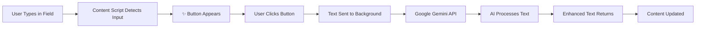

<div align="center">

# ✨ Nitro-Input-AI


### 🚀 AI-Powered Text Enhancement for Every Input Field

[](https://opensource.org/licenses/MIT)
[](https://www.google.com/chrome/)
[](https://www.microsoft.com/edge)
[](https://developer.chrome.com/docs/extensions/mv3/intro/)

A powerful browser extension that transforms any text input with AI assistance. When you type in any text field, a smart ✨ button appears instantly. Click it to get AI-powered suggestions, improvements, or responses using Google's Gemini API.

[🎯 Features](#-key-features) • [📦 Installation](#-installation) • [🎮 Usage](#-how-to-use) • [⚙️ Configuration](#-configuration) • [🤝 Contributing](#-contributing)

---

</div>

## 📋 Table of Contents

- [✨ Key Features](#-key-features)
- [🌐 Supported Browsers](#-supported-browsers)
- [📦 Installation](#-installation)
  - [Prerequisites](#prerequisites)
  - [Quick Install](#quick-install-developer-mode)
  - [Configuration](#-configuration)
- [🎮 How to Use](#-how-to-use)
  - [Basic Usage](#basic-usage)
  - [Advanced Usage](#advanced-usage)
- [💡 Usage Examples](#-usage-examples)
- [🏗️ How It Works](#-how-it-works)
- [🔧 Advanced Features](#-advanced-features)
- [🗂️ Project Structure](#️-project-structure)
- [🐛 Troubleshooting](#-troubleshooting)
- [🔐 Privacy & Security](#-privacy--security)
- [🤝 Contributing](#-contributing)
- [📄 License](#-license)

---

## ✨ Key Features

<table>
<tr>
<td width="50%">

### 🤖 AI-Powered Intelligence
- **Google Gemini Integration**: Leverages cutting-edge AI for text processing
- **Multiple Response Styles**: Short, detailed, step-by-step, or list format
- **Context-Aware Processing**: Understands and improves your text contextually
- **Real-time Responses**: Fast processing with streaming support

</td>
<td width="50%">

### 🎯 Smart Interface
- **Universal Compatibility**: Works on ALL pages and input types
- **Intelligent Positioning**: Button follows your cursor precisely
- **Shadow DOM Support**: Compatible with modern frameworks (React, Vue, Angular)
- **Dynamic Detection**: Automatically finds new inputs on dynamic pages

</td>
</tr>
<tr>
<td width="50%">

### 🎨 Customization
- **Theme Support**: Auto light/dark mode with manual override
- **Configurable Behavior**: Customize button position and appearance
- **Response Preferences**: Set your preferred AI response style
- **Privacy Controls**: Exclude password fields and sensitive inputs

</td>
<td width="50%">

### 🔒 Privacy & Security
- **Local Storage**: API keys stored securely in browser
- **No Tracking**: Zero analytics or data collection
- **Explicit Processing**: Text sent only when you click
- **HTTPS Encryption**: All communications are secure

</td>
</tr>
</table>

---

## 🌐 Supported Browsers

## 🌐 Supported Browsers

<table>
<tr>
<th>Browser</th>
<th>Version</th>
<th>Status</th>
<th>Notes</th>
</tr>
<tr>
<td>🔵 <strong>Google Chrome</strong></td>
<td>88+</td>
<td>✅ Fully Supported</td>
<td>Complete Manifest V3 support, best performance</td>
</tr>
<tr>
<td>🔷 <strong>Microsoft Edge</strong></td>
<td>88+</td>
<td>✅ Fully Supported</td>
<td>Chromium-based, all features available</td>
</tr>
<tr>
<td>🦁 <strong>Brave Browser</strong></td>
<td>1.20+</td>
<td>✅ Fully Supported</td>
<td>Privacy-focused, fully compatible</td>
</tr>
<tr>
<td>🔴 <strong>Opera</strong></td>
<td>74+</td>
<td>✅ Fully Supported</td>
<td>Chromium-based, seamless integration</td>
</tr>
<tr>
<td>🦊 <strong>Firefox</strong></td>
<td>109+</td>
<td>⚠️ Experimental</td>
<td>Core features work, some MV3 limitations</td>
</tr>
<tr>
<td>🌈 <strong>Vivaldi</strong></td>
<td>4.0+</td>
<td>✅ Fully Supported</td>
<td>Chromium-based, power-user friendly</td>
</tr>
<tr>
<td>🌉 <strong>Arc Browser</strong></td>
<td>Latest</td>
<td>✅ Fully Supported</td>
<td>Chromium-based, modern experience</td>
</tr>
</table>

> 💡 **Note**: Any Chromium-based browser with Manifest V3 support should work seamlessly!

---

## 📦 Installation

### Prerequisites

Before you begin, ensure you have:

1. **🔑 Google Gemini API Key**
   - Get your free API key from [Google AI Studio](https://makersuite.google.com/app/apikey)
   - Sign in with your Google account
   - Click "Create API Key" and copy it

2. **🌐 Supported Browser**
   - Chrome 88+ / Edge 88+ / Brave 1.20+ (recommended)
   - Or any Chromium-based browser with Manifest V3 support

---

### Quick Install (Developer Mode)

<details open>
<summary><b>📖 Step-by-Step Instructions</b></summary>

#### Step 1: Download the Extension
```bash
git clone https://github.com/rudrarathod/Nitro-Input-AI.git
cd Nitro-Input-AI
```

Or download the ZIP file and extract it.

#### Step 2: Open Extension Management
Choose your browser and navigate to:

| Browser | URL |
|---------|-----|
| 🔵 Chrome | `chrome://extensions/` |
| 🔷 Edge | `edge://extensions/` |
| 🦁 Brave | `brave://extensions/` |
| 🔴 Opera | `opera://extensions/` |
| 🦊 Firefox | `about:debugging#/runtime/this-firefox` |

#### Step 3: Enable Developer Mode
- Look for **"Developer mode"** toggle in the top-right corner
- Turn it **ON** 🔛

#### Step 4: Load the Extension
1. Click **"Load unpacked"** button
2. Navigate to the folder containing the extension
3. Select the folder with `manifest.json`
4. Click **"Select"** or **"Open"**

#### Step 5: Configure Your API Key
1. Click the extension icon (✨) in your browser toolbar
2. Enter your Gemini API key in the popup
3. Choose your preferred settings
4. Click **"Save"**

#### Step 6: Test It Out! 🎉
1. Navigate to any website (e.g., Gmail, Twitter, Reddit)
2. Click in a text field and start typing
3. Look for the ✨ button appearing near your cursor
4. Click it to enhance your text with AI!

</details>

---

### Alternative: Manual Installation (.crx file)

<details>
<summary><b>📦 For Pre-packaged Extension</b></summary>

1. Download the `.crx` file from releases (when available)
2. Open your browser's extension page
3. **Drag and drop** the `.crx` file onto the page
4. Click **"Add Extension"** when prompted
5. Configure your API key via the extension icon

> ⚠️ **Note**: Some browsers may require additional steps to install unsigned extensions.

</details>

---

## ⚙️ Configuration
## ⚙️ Configuration

Customize Nitro-Input-AI to match your workflow and preferences.

### 🎛️ Quick Settings (Popup)

Click the extension icon in your toolbar to access:

<table>
<tr>
<td width="30%"><b>🔑 API Key</b></td>
<td>Enter your Google Gemini API key (required for AI functionality)</td>
</tr>
<tr>
<td><b>🤖 AI Model</b></td>
<td>Choose between Gemini models (default: <code>gemini-2.5-flash</code>)</td>
</tr>
<tr>
<td><b>💬 Response Style</b></td>
<td>
<ul>
<li><b>Default</b>: Balanced responses</li>
<li><b>Short</b>: Concise, to-the-point answers</li>
<li><b>Detailed</b>: Comprehensive explanations</li>
<li><b>Step-by-step</b>: Numbered instructions</li>
<li><b>List</b>: Bullet-point format</li>
</ul>
</td>
</tr>
<tr>
<td><b>🎨 Theme</b></td>
<td>
<ul>
<li><b>Auto</b>: Matches your system theme</li>
<li><b>Light</b>: Always use light mode</li>
<li><b>Dark</b>: Always use dark mode</li>
</ul>
</td>
</tr>
<tr>
<td><b>🔒 Password Fields</b></td>
<td>Toggle whether to show the button on password inputs (disabled by default for security)</td>
</tr>
<tr>
<td><b>📍 Button Position</b></td>
<td>Choose where the ✨ button appears (top-right or center-right of input)</td>
</tr>
<tr>
<td><b>🌐 Shadow DOM</b></td>
<td>Enable support for modern web frameworks (React, Vue, Angular)</td>
</tr>
</table>

### 🔧 Advanced Settings

Access extended configuration via **Options Page**:
- Right-click extension icon → **Options**
- Or navigate to `chrome://extensions/` → Nitro-Input-AI → **Details** → **Extension options**

---

## 🎮 How to Use

### Basic Usage

The extension works seamlessly across all websites. Here's how to get started:

#### 1️⃣ Type in Any Text Field
Simply click into any input field and start typing. Supported fields include:
- 📧 Email composition boxes (Gmail, Outlook, etc.)
- 💬 Social media posts (Twitter, LinkedIn, Facebook)
- 📝 Text areas and comment sections
- 🔤 Single-line input fields
- ✏️ Content-editable divs (Medium, Notion, etc.)

#### 2️⃣ Spot the ✨ Button
The AI assistant button automatically appears when you:
- Focus on a text field
- Start typing
- Position your cursor in the field

The button intelligently positions itself near your cursor for easy access.

#### 3️⃣ Click to Enhance
Click the ✨ button and watch as AI:
- Analyzes your text
- Provides intelligent suggestions
- Improves grammar and clarity
- Expands or summarizes content
- Adjusts tone and style

#### 4️⃣ Review & Accept
- The AI response replaces your selected text or inserts at cursor
- Review the enhancement
- Continue editing as needed
- Use the **🛑 Stop** button if processing takes too long

---

### Advanced Usage

<details>
<summary><b>🎯 Power User Tips</b></summary>

#### Selective Text Enhancement
1. **Highlight specific text** in your input field
2. Click the ✨ button
3. Only the selected portion will be enhanced
4. Rest of your text remains unchanged

#### Keyboard-Friendly Workflow
```
1. Type your content
2. Tab to navigate (button is keyboard-accessible)
3. Press Enter/Space to activate AI
4. Continue with arrow keys
```

#### Context-Aware Processing
The AI understands context based on:
- The type of field you're typing in
- Surrounding text and formatting
- Your selected response style
- Previous enhancements in the session

#### Multi-line Text Support
- Works perfectly with wrapped text
- Handles line breaks and paragraphs
- Maintains formatting in rich text editors

</details>

---

### 🎬 Keyboard Workflow

For maximum productivity, use this streamlined workflow:

```
1. ⌨️  Type your content naturally
2. 🎯 Click ✨ button (or use planned keyboard shortcut)
3. ⏳ AI processes your text in real-time
4. ✅ Enhanced content appears instantly
5. 📝 Continue typing with improved text
```

> 🔮 **Coming Soon**: Custom keyboard shortcuts for power users!

---

## 🏗️ How It Works

Understanding the magic behind Nitro-Input-AI:



### 🔄 The Process

<table>
<tr>
<td width="5%">1️⃣</td>
<td width="25%"><b>Input Detection</b></td>
<td>Content script continuously monitors all text inputs, textareas, and contenteditable elements across the page</td>
</tr>
<tr>
<td>2️⃣</td>
<td><b>Smart Button Placement</b></td>
<td>When you focus or type, the ✨ button intelligently positions itself near your cursor, accounting for:
<ul>
<li>Scroll position</li>
<li>Multi-line text wrapping</li>
<li>Viewport boundaries</li>
<li>Shadow DOM elements</li>
</ul>
</td>
</tr>
<tr>
<td>3️⃣</td>
<td><b>AI Processing</b></td>
<td>On button click:
<ul>
<li>Text is captured (all content or selected portion)</li>
<li>Sent to background service worker</li>
<li>Forwarded to Google Gemini API with your style preferences</li>
<li>Processed using advanced language models</li>
</ul>
</td>
</tr>
<tr>
<td>4️⃣</td>
<td><b>Intelligent Replacement</b></td>
<td>AI response is seamlessly integrated:
<ul>
<li>Replaces selected text if any was highlighted</li>
<li>Inserts at cursor position otherwise</li>
<li>Maintains formatting in rich text editors</li>
<li>Preserves undo/redo history</li>
</ul>
</td>
</tr>
<tr>
<td>5️⃣</td>
<td><b>Real-time Feedback</b></td>
<td>Throughout the process:
<ul>
<li>Loading animation shows progress</li>
<li>Stop button allows cancellation</li>
<li>Error messages for troubleshooting</li>
<li>Success confirmation</li>
</ul>
</td>
</tr>
</table>

### 🛡️ Security Architecture

```
┌─────────────────┐      ┌──────────────────┐      ┌─────────────────┐
│   Web Page      │ ───▶ │ Content Script   │ ◀─▶  │ Background SW   │
│   (Isolated)    │      │  (Sandboxed)     │      │  (Secure)       │
└─────────────────┘      └──────────────────┘      └─────────────────┘
                                                             │
                                                             │ HTTPS
                                                             ▼
                                                    ┌─────────────────┐
                                                    │  Gemini API     │
                                                    │  (Google)       │
                                                    └─────────────────┘
```

- **Isolated Execution**: Content scripts run in isolated world, preventing page interference
- **Secure Storage**: API keys stored in browser's encrypted storage
- **HTTPS Only**: All API communications are encrypted
- **No Persistence**: Text is not stored or logged by the extension

---

## 🔧 Advanced Features

Nitro-Input-AI is packed with powerful capabilities:

<table>
<tr>
<td width="50%">

### 📏 Multi-line Support
- Accurate button positioning with wrapped text
- Handles complex text layouts
- Works with scrollable text areas
- Maintains position during typing

### 🌐 Shadow DOM Compatibility
- Works with modern web frameworks
- React, Vue, Angular support
- Web Components compatible
- Dynamic content detection

</td>
<td width="50%">

### ⚡ Dynamic Content
- Detects new inputs after page load
- Monitors DOM mutations
- Works with Single Page Apps (SPAs)
- Automatic reattachment on changes

### 🖼️ Cross-frame Support
- Functions within iframes
- Embedded content compatible
- Multiple frame handling
- Isolated frame processing

</td>
</tr>
</table>

### 🔮 Planned Features

- ⌨️ **Keyboard Shortcuts**: Customizable hotkeys for power users
- 📝 **Custom Prompts**: Create your own AI instruction templates
- 🌍 **Multi-language Support**: Enhanced language detection
- 📊 **Usage Analytics**: Track your productivity gains (optional)
- 🎯 **Context Menus**: Right-click enhancement options
- 💾 **Response History**: Save and reuse previous enhancements

---

## 🗂️ Project Structure

Understanding the extension architecture:

```
nitro-input-ai/
│
├── 📄 manifest.json          # Extension manifest (Manifest V3)
│   ├── Defines permissions and capabilities
│   ├── Configures content scripts and background worker
│   └── Sets extension metadata
│
├── ⚙️ background.js           # Service worker (background operations)
│   ├── Handles Gemini API communication
│   ├── Manages secure API key storage
│   ├── Processes AI requests/responses
│   └── Coordinates extension lifecycle
│
├── 💉 contentScript.js        # Main content injection logic
│   ├── Detects eligible input fields
│   ├── Injects and positions ✨ button
│   ├── Manages user interactions
│   ├── Handles Shadow DOM traversal
│   ├── Implements text replacement logic
│   └── Provides real-time feedback
│
├── 🎨 styles.css             # Extension styling
│   ├── Button appearance and animations
│   ├── Tooltip and loading states
│   ├── Light/dark theme support
│   └── Responsive design rules
│
├── 🖱️ popup.html + popup.js   # Quick settings popup
│   ├── API key configuration
│   ├── Model and style selection
│   ├── Quick toggles for features
│   └── Status indicators
│
├── 🔧 options.html + options.js   # Extended settings page
│   ├── Advanced configuration options
│   ├── Theme customization
│   ├── Button position settings
│   └── Privacy controls
│
└── 🎨 icons/                 # Extension icons
    ├── icon-16.png           # Toolbar icon (16×16)
    ├── icon-32.png           # Toolbar icon (32×32)
    ├── icon-48.png           # Extension page (48×48)
    ├── icon-128.png          # Chrome Web Store (128×128)
    └── icon.svg              # Vector source

```

### 📦 Key Technologies

- **Manifest V3**: Latest Chrome extension standard
- **Service Workers**: Background processing without persistent scripts
- **Content Scripts**: Isolated JavaScript injection into web pages
- **Chrome Storage API**: Secure, synced configuration storage
- **Google Gemini API**: Advanced AI language processing
- **Shadow DOM**: Modern web component compatibility
- **Mutation Observers**: Dynamic content detection

---

## 🐛 Troubleshooting

Having issues? Here are solutions to common problems:

### 🔴 Common Issues

<details>
<summary><b>❌ Button not appearing</b></summary>

**Possible Causes & Solutions:**

1. **Password field exclusion is enabled**
   - Check settings: Extension icon → Options → Uncheck "Exclude password fields"
   
2. **Unsupported input type**
   - The extension works with: text, email, textarea, contenteditable
   - Doesn't work with: buttons, checkboxes, radio buttons, etc.

3. **Page not loaded completely**
   - Wait for page to fully load
   - Try refreshing the page (Ctrl+R / Cmd+R)

4. **Extension disabled**
   - Visit `chrome://extensions/`
   - Ensure Nitro-Input-AI toggle is **ON**

5. **Shadow DOM disabled**
   - If using React/Vue/Angular apps, enable Shadow DOM support in settings

</details>

<details>
<summary><b>🔑 API errors / "Invalid API Key"</b></summary>

**Solutions:**

1. **Verify API key is correct**
   - Get a new key from [Google AI Studio](https://makersuite.google.com/app/apikey)
   - Copy the entire key (starts with "AIza")
   - Paste into extension popup → Save

2. **Check API key permissions**
   - Ensure API key has Gemini API enabled
   - Verify no usage limits are exceeded

3. **Network connectivity**
   - Check your internet connection
   - Try accessing https://generativelanguage.googleapis.com/ directly
   - Check if firewall/proxy is blocking requests

4. **API quota exceeded**
   - You may have hit daily/monthly limits
   - Check usage in [Google Cloud Console](https://console.cloud.google.com/)

</details>

<details>
<summary><b>📍 Positioning issues</b></summary>

**Solutions:**

1. **Button appears in wrong position**
   - Try changing anchor mode: Options → Anchor mode → "Center right" or "Top right"
   - Refresh the page after changing settings

2. **Button disappears when scrolling**
   - This is normal behavior for fixed-position elements
   - The button reappears when you refocus the input

3. **Button overlaps with other elements**
   - Try switching anchor position in settings
   - Some websites with custom styles may interfere

4. **Clear browser cache**
   - Go to `chrome://settings/clearBrowserData`
   - Clear cached images and files
   - Restart browser

</details>

<details>
<summary><b>🌑 Dark mode issues</b></summary>

**Solutions:**

- Extension auto-detects system theme by default
- Manual override: Extension popup → Theme → Select "Light" or "Dark"
- Try toggling between Auto/Light/Dark modes
- Some websites override theme colors (expected behavior)

</details>

<details>
<summary><b>⏳ Slow AI responses</b></summary>

**Solutions:**

1. **Use shorter text** - AI processes shorter content faster
2. **Change response style** - Try "Short" instead of "Detailed"
3. **Check internet speed** - Slow connection = slow responses
4. **Use stop button** - Click 🛑 to cancel if taking too long
5. **Try different model** - Some models are faster than others

</details>

---

### 🌐 Browser-Specific Issues

<table>
<tr>
<th>Browser</th>
<th>Known Issues</th>
<th>Solutions</th>
</tr>
<tr>
<td>🦊 <b>Firefox</b></td>
<td>
• Some MV3 features limited<br>
• Storage sync may not work
</td>
<td>
• Core features still functional<br>
• Settings stored locally<br>
• Manual configuration needed
</td>
</tr>
<tr>
<td>🍎 <b>Safari</b></td>
<td>
• Not supported (requires Safari Web Extensions)
</td>
<td>
• Safari port planned for future<br>
• Use Chrome/Edge for now
</td>
</tr>
<tr>
<td>🔒 <b>Brave</b></td>
<td>
• Shields may block extension
</td>
<td>
• Allow extension in Brave Shields<br>
• Whitelist extension domain
</td>
</tr>
</table>

---

### ⚡ Performance Tips

Maximize speed and efficiency:

| Tip | Benefit | How To |
|-----|---------|--------|
| 📏 **Use shorter text** | 2-3x faster processing | Highlight specific portions instead of entire paragraphs |
| 🎯 **Choose "Short" response style** | Faster API responses | Extension popup → Response style → Short |
| 🛑 **Use stop button** | Cancel slow requests | Click 🛑 button during processing |
| 🔄 **Refresh page** | Clear script buildup | Press F5 if extension feels sluggish |
| 🧹 **Clear cache** | Remove old data | `chrome://settings/clearBrowserData` |

---

### 🆘 Still Having Issues?

If none of the above solutions work:

1. **Check browser console** for errors:
   - Press F12 → Console tab
   - Look for red error messages
   - Screenshot and report

2. **Disable other extensions**:
   - Some extensions may conflict
   - Temporarily disable and test

3. **Reinstall extension**:
   - Remove extension
   - Re-download/clone repository
   - Follow installation steps again

4. **Report the issue**:
   - [Open an issue on GitHub](https://github.com/rudrarathod/Nitro-Input-AI/issues)
   - Include: Browser version, error messages, screenshots
   - We'll help you resolve it!

---

## 🔐 Privacy & Security

Your privacy and security are our top priorities. Here's how we protect you:

### 🔒 Data Protection

<table>
<tr>
<td width="50%">

#### What We Collect
- ❌ **Nothing!**
- No tracking
- No analytics
- No usage data
- No personal information
- No browsing history

</td>
<td width="50%">

#### What We Store (Locally)
- ✅ API Key (encrypted in browser storage)
- ✅ User preferences (theme, style settings)
- ✅ Configuration options
- ⚠️ All stored locally on YOUR device
- ⚠️ Synced via Chrome Sync (if enabled)

</td>
</tr>
</table>

---

### 🛡️ Security Measures

#### API Key Storage
```
🔐 Encrypted Storage → Chrome Storage API
└─ Uses browser's native encryption
└─ Stored locally (not on our servers)
└─ Synced securely via Chrome Sync (optional)
└─ Never transmitted except to Google Gemini API
```

#### Text Processing
- ✅ Text sent **only when you click** the ✨ button
- ✅ Processed by **Google Gemini API** (secure, encrypted HTTPS)
- ✅ Not stored or logged by the extension
- ✅ Not stored or logged by us (we have no servers!)
- ⚠️ Subject to [Google's Privacy Policy](https://policies.google.com/privacy)

#### Extension Permissions

| Permission | Why We Need It | What It Does |
|------------|----------------|--------------|
| `storage` | Save your settings | Stores API key and preferences locally |
| `<all_urls>` | Work on all websites | Inject AI button on any text field |
| `host_permissions` | Access Gemini API | Send text to Google for AI processing |

**We only request what we need. No hidden permissions.**

---

### 🔐 Password Field Protection

- 🔒 Password fields **excluded by default**
- 🔒 Prevent accidental API key exposure
- 🔒 Configurable in settings (enable at your own risk)
- 🔒 Even if enabled, text is never logged by extension

---

### 🌐 Third-Party Services

**We only use:**

1. **Google Gemini API**
   - Purpose: Process your text with AI
   - Data sent: Only the text you explicitly enhance
   - Privacy: Subject to [Google's Privacy Policy](https://policies.google.com/privacy)
   - Encryption: All HTTPS (end-to-end encrypted)

**We do NOT use:**
- ❌ Analytics (Google Analytics, etc.)
- ❌ Tracking pixels
- ❌ Advertising networks
- ❌ Data collection services
- ❌ Crash reporting services

---

### 🏆 Best Practices

<details>
<summary><b>🔐 How to Stay Safe</b></summary>

1. **Protect your API key**
   - Don't share it with anyone
   - Don't commit it to code repositories
   - Rotate it periodically

2. **Review text before sending**
   - Don't enhance sensitive information
   - Be cautious with personal data
   - Remember: text goes to Google's servers

3. **Keep extension updated**
   - Updates include security fixes
   - Check for updates regularly
   - Report any vulnerabilities you find

4. **Use secure connections**
   - Ensure HTTPS on websites
   - Avoid public WiFi for sensitive work
   - Extension uses HTTPS exclusively

</details>

---

### 🔍 Open Source Transparency

- ✅ **100% Open Source** - Review our code anytime
- ✅ **No obfuscation** - Every line is readable
- ✅ **Community audited** - Anyone can inspect for security issues
- ✅ **No hidden behavior** - What you see is what you get

[View Source Code on GitHub →](https://github.com/rudrarathod/Nitro-Input-AI)

---

## 🤝 Contributing

---

### 📱 Social Media Posts
**Before**: "just launched my new product check it out"

**After** (Engaging): "🚀 Excited to announce the launch of my new product! After months of hard work, it's finally here. Check it out and let me know what you think! #ProductLaunch #Innovation"

**Use Cases**:
- Generate engaging captions
- Add relevant hashtags
- Improve post readability
- Create call-to-action phrases

---

### 💻 Code Comments & Documentation
**Before**: "this function does stuff with data"

**After** (Clear): "Processes user input data by validating format, sanitizing content, and returning a normalized object suitable for database storage."

**Use Cases**:
- Write clear code comments
- Generate API documentation
- Explain complex algorithms
- Create README sections

---

### ✍️ Creative Writing
**Before**: "The sunset was nice"

**After** (Descriptive): "The sunset painted the sky in brilliant hues of orange and pink, casting a warm glow across the horizon as day gracefully yielded to the approaching night."

**Use Cases**:
- Enhance descriptive passages
- Get story continuation ideas
- Improve dialogue flow
- Expand on character descriptions

---

### 💼 Professional Communication
**Before**: "cant make it to meeting sorry"

**After** (Professional): "I sincerely apologize, but I won't be able to attend the meeting. Could we reschedule to a time that works for everyone?"

**Use Cases**:
- Polish Slack/Teams messages
- Write professional meeting notes
- Draft polite decline responses
- Improve business correspondence

---

### 🌍 Language Learning
**Before**: "I go to store yesterday for buy food"

**After** (Corrected): "I went to the store yesterday to buy food."

**Use Cases**:
- Grammar corrections
- Vocabulary suggestions
- Sentence structure improvements
- Idiomatic expression help

---

## 🤝 Contributing

We welcome contributions from the community! Here's how you can help make Nitro-Input-AI even better:

### 🌟 Ways to Contribute

<table>
<tr>
<td width="50%">

#### 🐛 Report Bugs
Found a bug? Help us fix it!
- Check [existing issues](https://github.com/rudrarathod/Nitro-Input-AI/issues)
- Create detailed bug report
- Include: Browser, version, steps to reproduce
- Add screenshots if applicable

#### 💡 Suggest Features
Have ideas for improvements?
- Open a [feature request](https://github.com/rudrarathod/Nitro-Input-AI/issues/new)
- Describe the feature and use case
- Explain why it would be valuable
- We'll discuss and prioritize

</td>
<td width="50%">

#### 🔧 Submit Code
Ready to code? Awesome!
- Fork the repository
- Create a feature branch
- Make your changes
- Test thoroughly
- Submit a pull request

#### 📚 Improve Documentation
Help others understand the project:
- Fix typos and errors
- Add examples and tutorials
- Improve installation guides
- Translate documentation

</td>
</tr>
</table>

---

### 🚀 Development Setup

```bash
# Clone the repository
git clone https://github.com/rudrarathod/Nitro-Input-AI.git
cd Nitro-Input-AI

# Load in your browser
# 1. Go to chrome://extensions/
# 2. Enable "Developer mode"
# 3. Click "Load unpacked"
# 4. Select the project directory

# Make changes and test
# Changes to JS/CSS require reload
# Changes to manifest.json require extension reload
```

---

### 📝 Pull Request Guidelines

Before submitting a PR, please ensure:

- ✅ **Code Quality**
  - Follow existing code style
  - Add comments for complex logic
  - No console.log() statements in production code

- ✅ **Testing**
  - Test on multiple browsers (Chrome, Edge, Firefox)
  - Test on different websites
  - Verify no regressions

- ✅ **Documentation**
  - Update README if needed
  - Add inline code comments
  - Document new features

- ✅ **Commit Messages**
  - Use clear, descriptive messages
  - Reference issues if applicable
  - Follow conventional commits format

---

### 🏅 Contributors

Thank you to all our contributors! 🎉

<!-- Auto-generated contributor list will go here -->

Want to see your name here? [Start contributing!](#-contributing)

---

## 📄 License

This project is licensed under the **MIT License** - see below for details:

```
MIT License

Copyright (c) 2024 Nitro-Input-AI Contributors

Permission is hereby granted, free of charge, to any person obtaining a copy
of this software and associated documentation files (the "Software"), to deal
in the Software without restriction, including without limitation the rights
to use, copy, modify, merge, publish, distribute, sublicense, and/or sell
copies of the Software, and to permit persons to whom the Software is
furnished to do so, subject to the following conditions:

The above copyright notice and this permission notice shall be included in all
copies or substantial portions of the Software.

THE SOFTWARE IS PROVIDED "AS IS", WITHOUT WARRANTY OF ANY KIND, EXPRESS OR
IMPLIED, INCLUDING BUT NOT LIMITED TO THE WARRANTIES OF MERCHANTABILITY,
FITNESS FOR A PARTICULAR PURPOSE AND NONINFRINGEMENT. IN NO EVENT SHALL THE
AUTHORS OR COPYRIGHT HOLDERS BE LIABLE FOR ANY CLAIM, DAMAGES OR OTHER
LIABILITY, WHETHER IN AN ACTION OF CONTRACT, TORT OR OTHERWISE, ARISING FROM,
OUT OF OR IN CONNECTION WITH THE SOFTWARE OR THE USE OR OTHER DEALINGS IN THE
SOFTWARE.
```

**What this means for you:**
- ✅ Free to use for personal and commercial projects
- ✅ Modify and adapt to your needs
- ✅ Share and distribute
- ✅ No warranty or liability
- ⚠️ Must include original license notice

---

## 🔗 Links & Resources

<div align="center">

### 📱 Connect With Us

[](https://github.com/rudrarathod/Nitro-Input-AI)
[](https://github.com/rudrarathod/Nitro-Input-AI/issues)
[](https://github.com/rudrarathod/Nitro-Input-AI/discussions)

### 🌟 Related Resources

- [Google Gemini API Documentation](https://ai.google.dev/docs)
- [Chrome Extension Developer Guide](https://developer.chrome.com/docs/extensions/)
- [Manifest V3 Migration Guide](https://developer.chrome.com/docs/extensions/mv3/intro/)
- [Shadow DOM Explained](https://developer.mozilla.org/en-US/docs/Web/Web_Components/Using_shadow_DOM)

---

### ⭐ Show Your Support

If you find Nitro-Input-AI useful, please consider:

- ⭐ **Star this repository** on GitHub
- 🐦 **Share** with your friends and colleagues
- 💬 **Leave feedback** in discussions
- 🤝 **Contribute** to make it even better

---

**Made with ❤️ by the Nitro-Input-AI Team**

*Empowering your text input with AI, one field at a time* ✨

</div>
